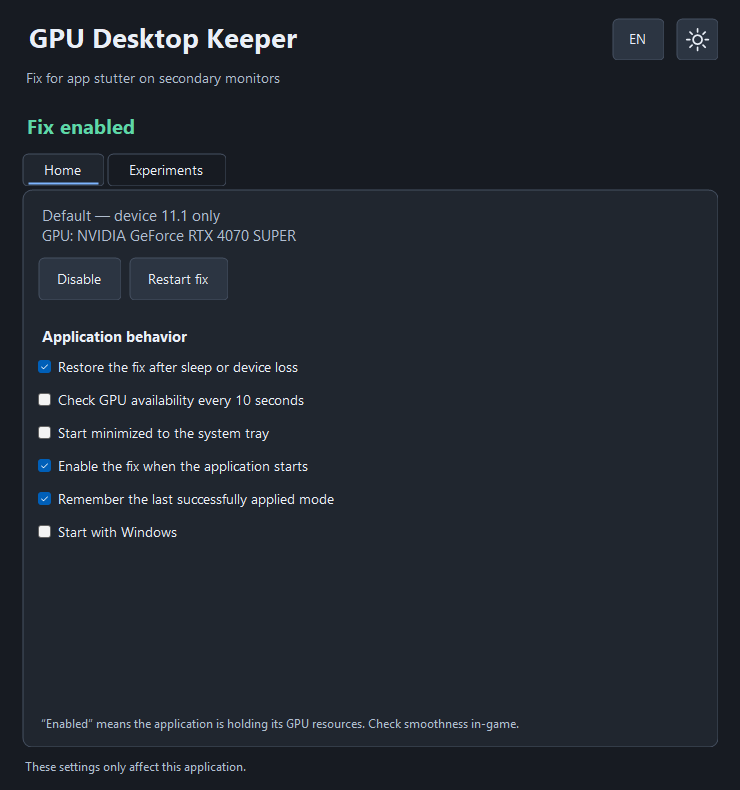

# GPU Desktop Keeper 1.0

[Русская документация](README.md)

A lightweight Windows utility that **may reduce interface and video stutter on secondary monitors while a game heavily loads an NVIDIA GPU**. It retains its own hardware Direct3D 11 device. The effect was discovered experimentally; the exact mechanism inside the driver and compatibility across systems have not been established.



## Download and run

1. Download the portable ZIP from [Releases](https://github.com/TheSanyas/GPU-Desktop-Keeper/releases).
2. Extract it to a permanent folder writable by your Windows account. Keep `GpuDesktopKeeper.exe.config` next to the EXE.
3. Run `GpuDesktopKeeper.exe`. The fix starts enabled in the default mode.
4. Click **RU** to switch to **EN** using the language button immediately to the left of the theme button. The choice is saved; switching does not recreate the GPU device.
5. Return focus to the game and compare secondary-monitor smoothness with the fix enabled and disabled in the same scene.

Closing the window hides it in the system tray. Choose **Exit** in the tray menu to terminate Keeper and release its resources. Settings and logs are saved next to the EXE as `keeper-settings.json` and `keeper.log`. Close the previous instance before updating. If you move the EXE, uncheck and recheck **Start with Windows** to update the startup task.

## Requirements

- .NET Framework 4.8, Direct3D 11 and hardware feature level 11.1 support. The tested system runs Windows 11 with an NVIDIA GeForce RTX 4070 SUPER and multiple monitors.
- The implementation uses the default hardware adapter and requires NVIDIA. AMD/Intel and other configurations have not been validated.
- HAGS and application hardware acceleration can remain enabled. Results depend on the driver, system and workload; this is not a guaranteed fix for all stutter.
- Flydigi Space Station interfered with the fix on one tested system. If stutter returns, try completely exiting its GUI via the tray icon. Keeper does not close other applications.

## How it works

The default mode creates a hardware Direct3D 11 device with feature level 11.1 and retains both the device and its immediate context. It creates no helper buffers. There is no swap chain or continuous Draw/Present/Map/Flush loop through this device. Initialization, the UI and internal driver behavior still consume resources; zero overhead is not claimed.

Keeper does not inject into games, adjust other processes' priorities, reserve a share of the GPU, or change HAGS, MPO, G-SYNC or NVIDIA profiles. Retaining the device changes graphics-stack state, but exactly why that helps the observed scenario remains unknown.

Experimental modes retain one 96-byte or 8192-byte dynamic vertex buffer, or both. These are buffer payload sizes, not total driver memory usage. The experimental modes have not been shown to work better.

Recovery after sleep/device loss is enabled by default, with up to three attempts after 2, 5 and 15 seconds. The optional 10-second GPU health check is disabled by default. Manually disabling the fix prevents automatic recovery from re-enabling it.

## Language and theme

Russian and English cover tabs, mode names, status text, tray menus, Flydigi notices and application-owned startup messages. Windows/driver error details remain verbatim. Existing settings without a language field retain Russian. Language and theme choices are independent and persist between launches.

## Startup

**Start with Windows** registers `GPU Desktop Keeper - <SID>` in the root of Task Scheduler:

- Trigger: any user logon, rather than system boot before sign-in.
- Principal: the task owner's existing interactive session, `InteractiveToken / LeastPrivilege`. Another user's logon does not move Keeper into that user's session.
- Action: the current EXE with `--startup`, starting quietly in the tray. No execution time limit; duplicate instances are ignored.
- Keeper itself runs without elevation. If task registration is denied, only the short configuration helper requests UAC.
- Registration occurs only when changing the checkbox. An older Keeper Run entry is removed only after confirmed task registration. Unrelated tasks and registry values are not modified.

## Build and checks

On Windows with .NET Framework 4.8 and PowerShell, run:

```powershell
.\Build.ps1 -RunChecks
```

No Visual Studio or NuGet packages are needed. The script uses the system Framework compiler and produces an x86 executable and config in `bin/`. The icon is generated and embedded locally. If execution policy blocks local scripts, `Set-ExecutionPolicy -Scope Process -ExecutionPolicy RemoteSigned` affects only the current PowerShell session. Review downloaded source before unblocking it if necessary.

`--check-core` uses simulated GPU resources to check lifecycle, preferences, startup logic and UI behavior. `--preview` renders both languages/themes without creating a real GPU device. `--preview-live` opens a test window with simulated resources. `--check` creates real devices; `--check-startup` registers a temporary test task. These checks do not benchmark game smoothness.

Report issues with your Windows build, GPU/driver, HAGS setting, game/API/window mode, monitors, Keeper mode and an enabled/disabled comparison while the game remains focused. Check logs for personal paths before posting them.

## License

[MIT](LICENSE).
