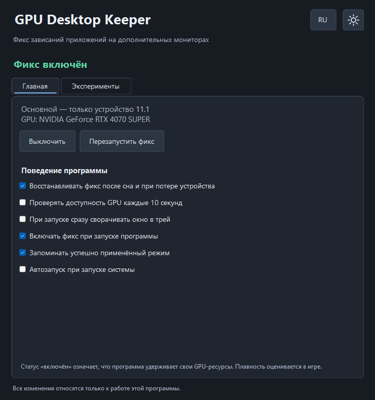

# GPU Desktop Keeper 1.0

[English documentation](README.en.md)

Небольшая утилита для Windows, которая **может устранять рывки интерфейса и видео на дополнительных мониторах при игре с высокой загрузкой GPU**. Работает через удержание собственного аппаратного Direct3D 11 устройства. Эффект обнаружен экспериментально; универсальная совместимость и точный механизм внутри драйвера не установлены.



## Что делает программа

Основной режим создаёт устройство с feature level 11.1 и immediate context на адаптере по умолчанию и удерживает ссылки до выключения фикса или выхода из программы. Вспомогательные буферы в основном режиме не создаются. Устройство проверяется на принадлежность NVIDIA.

Keeper не отправляет цикл отрисовки через это устройство: нет swap chain, вызовов Draw/Present/Map/Flush и фоновой нагрузки для искусственного занятия GPU. Сам интерфейс Windows, инициализация устройства и работа драйвера тоже используют ресурсы, поэтому «нулевые CPU/GPU/VRAM» не заявляются.

Программа не меняет приоритеты игр и приложений, не внедряется в их процессы, не резервирует процент GPU и не меняет HAGS, MPO, G-SYNC или профили драйвера. Наличие живого устройства изменяет состояние графического стека; почему это устраняет именно наблюдаемый сценарий, пока неизвестно. Подробности: [принцип работы и границы доказанного](docs/ARCHITECTURE.md).

## Совместимость

- Целевая и проверенная среда — Windows 11, NVIDIA GeForce RTX 4070 SUPER, несколько мониторов.
- Нужны .NET Framework 4.8, рабочий Direct3D 11 runtime и аппаратная поддержка feature level 11.1.
- Текущая реализация использует адаптер по умолчанию и прекращает инициализацию, если он не NVIDIA. AMD/Intel, другие адаптеры и остальные конфигурации не валидированы.
- HAGS и аппаратное ускорение приложений можно оставить включёнными. Эффект зависит от системы, драйвера и нагрузки; исправление любого вида лагов не гарантируется.

## Запуск

1. Распакуй portable-архив в постоянную папку с правом записи пользователя. Оставь `GpuDesktopKeeper.exe.config` рядом с EXE.
2. Запусти `GpuDesktopKeeper.exe` обычным способом. Фикс включается по умолчанию в основном режиме.
3. Верни фокус в игру и сравни плавность второго монитора в той же сцене с фиксом и без него. Статус «включён» подтверждает удержание ресурсов, а не измерение FPS.
4. Крестик скрывает окно в трей. «Выход» в меню трея полностью завершает процесс и освобождает собственные ресурсы.

Настройки сохраняются в `keeper-settings.json`, журнал — в `keeper.log` рядом с EXE. При обновлении перенеси свой JSON при закрытом Keeper. При изменении пути EXE обнови задачу автозапуска, сняв и снова включив галочку.

Кнопка **RU / EN** слева от переключателя темы меняет язык интерфейса сразу и сохраняет выбор. Она показывает текущий язык. Перевод распространяется на вкладки, режимы, статусы, меню трея и предупреждения. Технические сообщения Windows/драйвера сохраняются в исходном виде. Старые настройки без языка открываются на русском.

## Режимы и восстановление

Основной режим — устройство 11.1 без вспомогательных буферов. Эксперименты добавляют один динамический vertex buffer на 96 или 8192 байта, либо оба. Это размеры данных буферов, а не полное потребление памяти драйвера. Экспериментальные режимы не доказаны как более эффективные.

Автовосстановление после сна/потери устройства включено по умолчанию: до трёх попыток через 2, 5 и 15 секунд. Периодический опрос `GetDeviceRemovedReason` каждые 10 секунд — отдельная опция, по умолчанию выключенная. Ручное выключение фикса не отменяется автовосстановлением.

Flydigi Space Station мешал фиксу в одной проверенной конфигурации; закрытие его GUI устраняло вмешательство. Это наблюдение, не установленная несовместимость всех версий. Предупреждение можно скрыть. Keeper сам не закрывает сторонние программы.

## Автозапуск

Галочка «Автозапуск при запуске системы» создаёт задачу `GPU Desktop Keeper - <SID>` в корне библиотеки планировщика.

- Триггер — **вход любого пользователя**, а не загрузка системы до входа.
- Выполнение — **в существующем интерактивном сеансе владельца задачи**, `InteractiveToken / LeastPrivilege`. Вход другого пользователя не переносит программу в его сеанс.
- Действие — текущий EXE с `--startup`, запуск тихо в трей. Лимит длительности выключен, повторные экземпляры игнорируются.
- Обычный Keeper не требует повышения прав. Если изменение задачи получает отказ в доступе, только короткий помощник регистрации запрашивает UAC. Выполнение самой задачи остаётся с обычными правами.
- Настройка выполняется только по галочке. При наличии старого собственного значения Run оно удаляется лишь после подтверждённой регистрации задачи; чужие значения и задачи не затрагиваются.

## Сборка из исходников

Нужны Windows с .NET Framework 4.8 и PowerShell. Установка NuGet-пакетов и Visual Studio не требуется: используется системный компилятор Framework. Бинарник x86 сохраняет проверенный путь взаимодействия с Direct3D.

```powershell
# Из папки исходников:
.\Build.ps1 -RunChecks
```

Если локальная политика PowerShell запрещает сценарии, для этого окна можно разрешить локальные сценарии командой `Set-ExecutionPolicy -Scope Process -ExecutionPolicy RemoteSigned`; постоянная политика системы не требуется. Если ZIP помечен Windows как полученный из интернета, сначала проверь исходники и при необходимости разблокируй скачанный архив перед распаковкой.

Результат: `bin/GpuDesktopKeeper.exe` и `.exe.config`. Иконка генерируется локально `BuildIcon.ps1` и встраивается в EXE. Сборка не меняет настройки Windows или драйвера.

## Проверки и отчёты

| Команда | Действие |
|---|---|
| `--check-core` | Подставные GPU-ресурсы, настройки, UI и логика автозапуска; настоящий GPU не используется |
| `--preview` | PNG интерфейса в обеих темах, без настоящего GPU |
| `--preview-live` | Настоящее тестовое окно с подставными ресурсами, без сохранения настроек, трея и автозапуска |
| `--check` | Создаёт и освобождает настоящие устройства/буферы для проверки инициализации |
| `--check-startup` | Создаёт и удаляет временную задачу, запускает короткий проверочный процесс без GPU; с триггером любого пользователя нужен повышенный запуск проверки |

Результаты команд сохраняются рядом с EXE. Проверки жизненного цикла не измеряют плавность игр. Для первого публичного выпуска выполнены сборка, `--check-core` и `--preview`; реальные GPU-тесты и новая регистрация рабочей задачи при подготовке не выполнялись.

Проблемы сообщай через GitHub Issues: укажи сборку Windows, GPU/драйвер, HAGS, игру/API/режим окна, мониторы, выбранный режим Keeper и результат сравнения с включённым/выключенным фиксом. Перед публикацией журнала проверь пути и другие личные сведения в тексте ошибок.

## Лицензия

[MIT](LICENSE).
